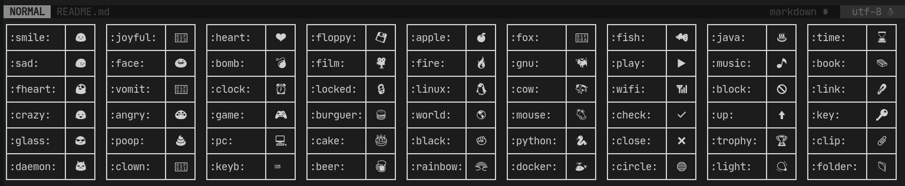

# vim-simple-emoji
A simple auto-complete of emoji for Vim. As short as possible!

[](https://terminalroot.com.br/)
[](https://github.com/sindresorhus/awesome)




> I got tired of installing plugins that had a very large number of emoji, since most of those +1,000 I only used around 50 at most. So I created this one that in addition to less emojis is easier to use.

# Instalations various software
Lazygit:
```sh
LAZYGIT_VERSION=$(curl -s "https://api.github.com/repos/jesseduffield/lazygit/releases/latest" | grep -Po '"tag_name": "v\K[^"]*')
curl -Lo lazygit.tar.gz "https://github.com/jesseduffield/lazygit/releases/latest/download/lazygit_${LAZYGIT_VERSION}_Linux_x86_64.tar.gz"
tar xf lazygit.tar.gz lazygit
sudo install lazygit /usr/local/bin
```

Store Git password:

```sh
git config --global credential.helper store
```
ssh without password:

```sh
ssh-keygen
ssh-copy-id -i .ssh/id_rsa.pub dietpi.local        
ssh-copy-id -i .ssh/id_rsa.pub tuxracer@freeshell.de
```
Git commands (cmd):

```sh
git status
git add .
git commit -m"commentaar"
git push
```

WSL and GUI :

install en start VCXSRV
kies: one large window, no client, check disable access control!!!
op WSL:
export DISPLAY=$(ip route | grep default | awk '{print $3; exit;}'):0.0   (zet evt in .profile)


```sh
```


# Use
Enter the name of the emoji between two points and then press the *[space]* button and the emoji will be displayed at the cursor position. Example:
```viml
:smile:<space>
```
This will result in: 😃 

## How to know the name of all emojis?
The list of all names you can get by running the command: `:ShowEmoji`.
> Some names have been modified to make them more peculiar, example: `:linux:` will display the penguin 🐧 

# License
[GNU GPLv3](LICENSE)


